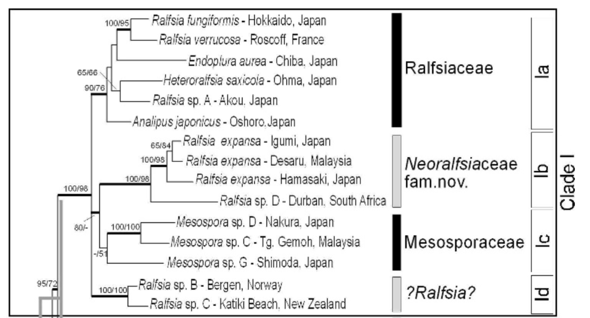

# Phylogeny Aberdeen 2019

## Hands-on phylogenetic tools given at Aberdeen Univeristy in October 2019

This repository contains the different tools used during the four days workshop organised at the Aberdeen Univeristy in October 2019.
Its aim was to provide a first and practical insighit in phylogenetic tools with a focus on online platforms and critical analyses of phylogenetic trees.

The dataset used for the practicals is a fragment of the data produced by [Lim *et al.* (2007)](https://www.tandfonline.com/doi/full/10.2216/06-90.1) on Ralfsiales (Phaeophyceae, Ochrophyta).

  

A tutorial has been written from this practical session in order to allow anyone to construct trees from sequences. However, this does not aim to be a comprehensive overview on phylogenetic tools.
